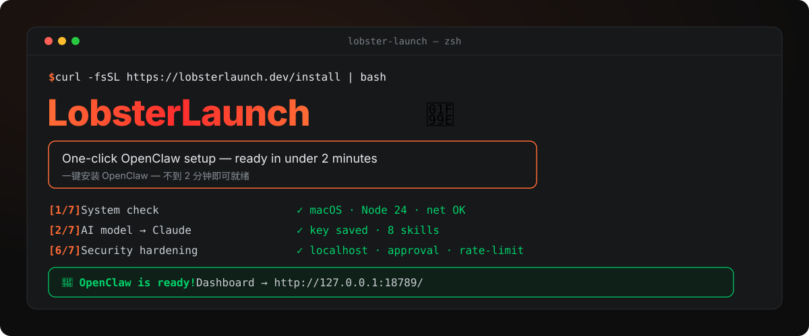
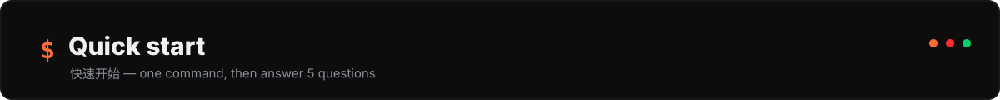
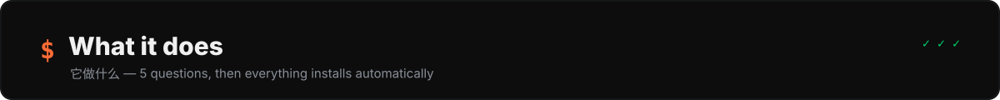
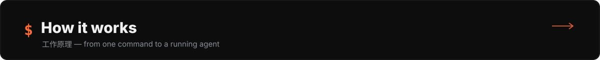
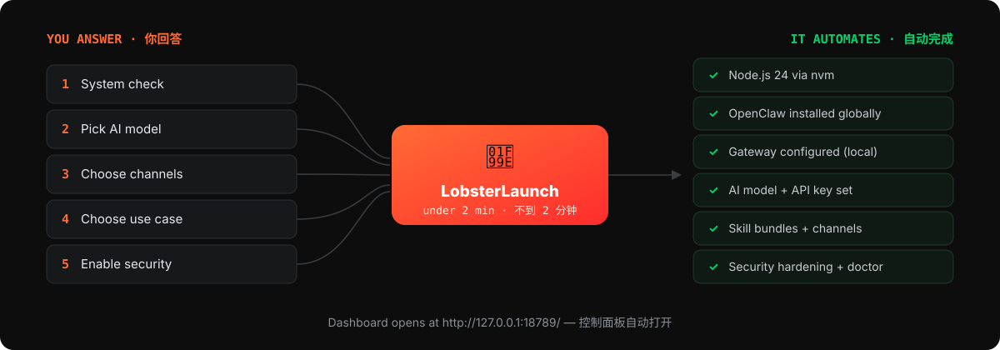
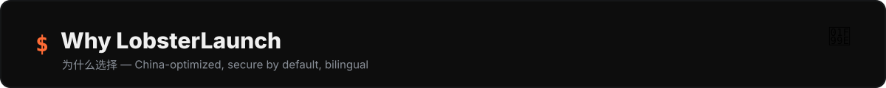

<p align="center">
  
</p>

<p align="center">
  
  
  
  
  
</p>

<p align="center">
  <b>One-click OpenClaw auto-setup — ready in under 2 minutes.</b><br>
  <b>一键安装 OpenClaw — 不到 2 分钟即可就绪。</b><br>
  <sub>Stop paying $200 for OpenClaw installation. LobsterLaunch does it all for free.</sub><br>
  <sub>不用再花钱找人装 OpenClaw 了。LobsterLaunch 完全免费。</sub>
</p>

---



Pick whichever fits your machine. Each path ends the same way: the wizard opens and asks you 5 questions.
任选一种方式。每条路径最终都一样：向导启动并向您提出 5 个问题。

**Option 1 — one command (macOS / Linux / WSL2):**

```bash
curl -fsSL https://raw.githubusercontent.com/xidik12/lobster-launch/main/scripts/install.sh | bash
```

**Option 2 — npm:**

```bash
npm install -g lobster-launch
lobster-launch
```

**Option 3 — macOS double-click:**

Download [`LobsterLaunch.command`](https://raw.githubusercontent.com/xidik12/lobster-launch/main/scripts/LobsterLaunch.command) and double-click it.
下载 [`LobsterLaunch.command`](https://raw.githubusercontent.com/xidik12/lobster-launch/main/scripts/LobsterLaunch.command) 后双击运行。

---



LobsterLaunch asks **5 questions**, then installs and configures everything for you.
LobsterLaunch 会问您 **5 个问题**，然后自动安装并配置好一切。

| # | Question | 问题 | What it decides |
|---|----------|------|-----------------|
| 1 | System check | 系统检查 | Detects OS, Node.js, RAM, disk, network (auto-detects China) |
| 2 | AI model | AI 模型 | Claude, GPT-4o, DeepSeek, Qwen, Gemini, or local Ollama |
| 3 | Channels | 通讯渠道 | Telegram, WhatsApp, WeChat, Discord, Slack, Feishu + more |
| 4 | Use case | 使用场景 | Auto-installs the matching skill bundle |
| 5 | Security | 安全加固 | Localhost binding, approval mode, rate limits, memory pruning |

Then it does the rest automatically — 之后自动完成：

- ✅ Installs **Node.js 24** via nvm (if missing or outdated) — 通过 nvm 安装 Node.js 24
- ✅ Installs **OpenClaw** globally — 全局安装 OpenClaw
- ✅ Configures the **gateway** (local mode, daemon) — 配置本地网关守护进程
- ✅ Sets up your **AI model** with its API key — 配置 AI 模型与密钥
- ✅ Installs **skill bundles** for your use case — 安装对应技能包
- ✅ Configures **messaging channels** — 配置通讯渠道
- ✅ Applies **security hardening** — 应用安全加固
- ✅ Runs **diagnostics** to fix issues, then opens the **dashboard** — 诊断修复并打开控制面板

---



<p align="center">
  
</p>

You answer five questions; LobsterLaunch turns them into eight automated setup steps and finishes at a running dashboard.
您回答五个问题，LobsterLaunch 将其转化为八个自动安装步骤，最终打开可用的控制面板。

---



- **⚡ One command, done — 一条命令搞定.** No manual Node.js install, no config-file editing, no debugging. 无需手动装 Node、无需改配置文件。
- **🌍 China-optimized — 中国网络优化.** Auto-detects Chinese networks and uses **npmmirror** for npm and a **Gitee mirror** for nvm; supports **DeepSeek** and **Qwen**; includes **WeChat** and **Feishu**.
- **🔒 Secure by default — 默认安全.** Binds the gateway to localhost, enables approval mode, disables auto-exec, and sets rate limits — the misconfigurations that expose agents are closed up front.
- **🧠 Smart skill bundles — 智能技能包.** Tell it your use case and it installs the right skills. Trading, development, customer support — done.
- **🔧 Built-in doctor — 内置医生.** Auto-fixes the most common OpenClaw issues any time you run `lobster-launch doctor`.
- **🇨🇳🇺🇸 Bilingual — 完整双语.** Every prompt, message, and error in English and 中文.

---

## Supported AI models · 支持的 AI 模型

| Model | Provider | Best for |
|-------|----------|----------|
| Claude | Anthropic | Best overall quality — 综合最佳 |
| GPT-4o | OpenAI | Great alternative — 优秀替代 |
| DeepSeek | DeepSeek | Best value, popular in China — 性价比最高，国内热门 |
| Qwen (通义千问) | Alibaba | Best for Chinese tasks — 中文任务最佳 |
| Gemini | Google | Good free tier — 免费额度好 |
| Local (Ollama) | Your machine | Free, offline, private — 免费、离线、私密 |

## Supported channels (20+) · 支持的渠道

Telegram · WhatsApp · WeChat (微信) · Discord · Slack · Feishu (飞书) · LINE · iMessage · Signal · Matrix · Microsoft Teams · Email · and more.

## Smart skill bundles · 智能技能包

Tell LobsterLaunch what you want to do — 告诉 LobsterLaunch 您想做什么：

| Use case | 场景 | Skills installed |
|----------|------|------------------|
| 🏠 Personal assistant | 个人助手 | Calendar, reminders, todos, weather, notes |
| 💼 Work productivity | 办公效率 | Email, meetings, docs, tasks, PDFs |
| 💻 Software development | 软件开发 | GitHub, code review, deploy, CI/CD, logs |
| 📱 Social media | 社交媒体 | Twitter, Instagram, analytics, scheduling |
| 📈 Trading & finance | 交易与金融 | Market data, alerts, portfolio, analysis |
| 🎧 Customer support | 客户服务 | Tickets, FAQ, sentiment, CRM |
| 🔬 Research | 研究 | Web search, papers, notes, citations |
| 🛒 E-commerce | 电子商务 | Inventory, orders, pricing, reviews |

---

## Built-in doctor · 内置医生

Fix common OpenClaw issues with one command — 一条命令修复常见问题：

```bash
lobster-launch doctor
```

Auto-fixes — 自动修复：

- Gateway mode not set — 网关模式未设置
- Port 18789 conflicts — 端口 18789 冲突
- Invalid config keys — 无效配置项
- Missing gateway token — 缺失网关令牌
- Post-upgrade config breakage — 升级后配置损坏

## Security hardening · 安全加固

Applied by default — 默认应用：

- **Gateway bound to `127.0.0.1`** (not `0.0.0.0`) — prevents network exposure — 仅绑定本地回环
- **Approval mode enabled** — require confirmation for sensitive actions — 敏感操作需确认
- **Auto-exec disabled** — mitigate prompt-injection attacks — 禁用自动执行
- **Memory pruning** — limit to 10K entries — 内存条目上限 10K
- **Rate limiting** — 60 requests/minute — 限速 60 次/分钟

## Requirements · 系统要求

- **macOS 12+**, **Linux (Ubuntu 20.04+)**, or **Windows (WSL2)**
- **8 GB RAM** (16 GB recommended for multi-agent) — 8 GB 内存（多智能体建议 16 GB）
- **10 GB disk space** — 10 GB 磁盘空间
- Internet connection — 网络连接
- An API key from your chosen provider (not needed for Ollama) — 所选模型的 API 密钥（Ollama 无需）

---

## Pro version · 专业版

| Feature | Free | Pro ($9.99/mo · ¥68) |
|---------|------|----------------------|
| Auto-setup wizard · 自动安装向导 | ✅ | ✅ |
| 6 AI models · 6 个 AI 模型 | ✅ | ✅ |
| 20+ channels · 20+ 渠道 | ✅ | ✅ |
| Basic skill bundles · 基础技能包 | ✅ | ✅ |
| Security hardening · 安全加固 | ✅ | ✅ |
| Built-in doctor · 内置医生 | ✅ | ✅ |
| Auto-updates · 自动更新 | ❌ | ✅ |
| 50+ premium skills · 50+ 高级技能 | ❌ | ✅ |
| Multi-agent orchestration · 多智能体编排 | ❌ | ✅ |
| Channel auto-reconnect · 渠道自动重连 | ❌ | ✅ |
| Health monitoring · 健康监控 | ❌ | ✅ |
| Priority support · 优先支持 (EN + 中文) | ❌ | ✅ |

## Contributing · 参与贡献

PRs welcome — please open an issue first for major changes. 欢迎 PR，重大改动请先开 issue。

```bash
git clone https://github.com/xidik12/lobster-launch.git
cd lobster-launch
npm install
node bin/lobster-launch.js
```

## License · 许可

MIT.

LobsterLaunch is not affiliated with OpenClaw. OpenClaw is MIT-licensed open-source software.
LobsterLaunch 与 OpenClaw 无隶属关系。OpenClaw 是 MIT 许可的开源软件。

---

<p align="center">
  <b>🦞 Stop paying for OpenClaw setup. LobsterLaunch is free forever. 🦞</b><br>
  <b>🦞 不用再花钱装 OpenClaw 了。LobsterLaunch 永远免费。 🦞</b>
</p>
